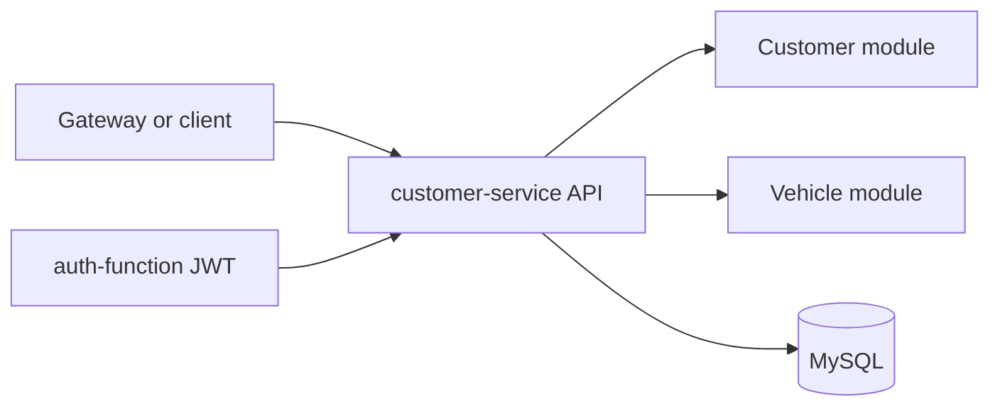

# Customer Service

`customer-service` owns customers and vehicles in the Phase 4 architecture.

## Responsibility

- customer registration, query, update and soft deletion
- vehicle registration, query, update and soft deletion
- CPF-based authentication integration through local JWT validation
- service-owned MySQL persistence only

This service does not read or write any database from `os-service`,
`workshop-service` or `billing-service`.

## Technology

- NestJS
- TypeORM
- MySQL
- Swagger
- Prometheus `/metrics`
- JSON logs with `correlationId`
- Dockerfile and Docker Compose
- Kubernetes manifests
- Sonar configuration

## Architecture



## Data Ownership

- owned database: MySQL
- owned aggregates: customers and vehicles
- no cross-service database access

## Main API Groups

Swagger is the reference for the full contract:

- local Swagger URL: `http://localhost:3000/docs`
- route groups:
  - `customers`
  - `vehicles`
  - `platform` (`/health`, `/ready`, `/metrics`)

## Messaging

Business events are not connected in the current code. The repository contains
only the generic RabbitMQ infrastructure introduced earlier.

- published events: none
- consumed events: none

## Environment Variables

See `.env.example` for the safe local template.

Key variables:

- `PORT`
- `SERVICE_NAME`
- `SERVICE_VERSION`
- `DB_HOST`
- `DB_PORT`
- `DB_USERNAME`
- `DB_PASSWORD`
- `DB_DATABASE`
- `DB_SSL`
- `JWT_SECRET`
- `JWT_ISSUER`
- `JWT_AUDIENCE`
- `JWT_REQUIRED_CUSTOMER_STATUS`
- `METRICS_ENABLED`
- `MESSAGING_ENABLED`

Do not commit real secrets.

## Local Execution

```bash
npm ci
npm run start:dev
```

Local supporting assets:

- `Dockerfile`
- `docker-compose.yml`

## Migrations

```bash
npm run migration:run
npm run migration:run:prod
npm run migration:revert
```

## Tests And Validation

```bash
npm run format
npm run lint
npm run build
npm test -- --runInBand
npm run test:cov
docker compose --env-file .env.example config
kubectl kustomize k8s
```

Jest enforces `80%` minimum for statements, branches, functions and lines.

## CI/CD

Workflow files:

- `.github/workflows/ci.yml`
- `.github/workflows/cd.yml`

CI validates lint, build, coverage, Docker build, Kubernetes render and Sonar.

CD is configured for:

- `homologation` -> GitHub Environment `homologation`
- `main` -> GitHub Environment `production`

This README documents pipeline configuration only. It does not claim a hosted
deployment was executed from this workspace.

## Kubernetes

This repository contains service-local manifests under `k8s/`:

- `Deployment`
- `Service`
- `ConfigMap`
- `Secret` template
- `HorizontalPodAutoscaler`

Local render:

```bash
kubectl kustomize k8s
```

## Observability

- `/metrics`
- JSON logs
- propagated `correlationId`
- readiness `/ready`
- liveness `/health`
- Prometheus scrape annotations in `k8s/`

## External Dependencies

- MySQL
- JWT issued by `auth-function`
- Kong/API Gateway in hosted environments

## Delivery Evidence

- repository URL: `PENDING`
- homologation URL: `PENDING`
- latest successful CI run: `PENDING`
- quality gate: `PENDING`
- coverage evidence: `96.5% statements, 84.69% branches, 94.42% functions, 96.61% lines (local artifact); hosted link/print PENDING`
- branch protection: `PENDING VERIFICATION`
- Swagger hosted URL: `PENDING`

## External Evidence Status

- hosted repository and Swagger URLs: `PENDING`
- branch protection and environments: `PENDING VERIFICATION`
- no deploy was executed from this workspace
